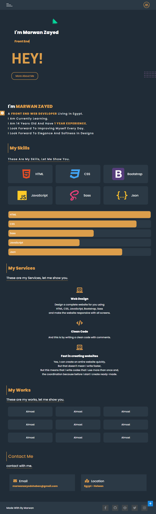

[Demo](https://maro-portfolio.netlify.app/)

> Start Code

_*HTML*_
```
<!DOCTYPE html>
<html lang="en">
  <head>
    <meta charset="UTF-8" />
    <meta http-equiv="X-UA-Compatible" content="IE=edge" />
    <meta name="viewport" content="width=device-width, initial-scale=1.0" />
    <meta
      name="description"
      content="The site where I will present my projects, profile and services that I can provide to you. Thank you for visiting the site"
    />
    <meta name="keywords" content="portfolio, personal site" />
    <meta name="copyright" content="Marwan Zayed" />
    <meta name="author" content="Marwan" />
    <link rel="icon" href="images/m.jpg" width="45" height="45" />

    <title>Portfolio</title>
    <!-- Font Awesome Icon -->
    <link rel="stylesheet" href="css/all.min.css" />
    <link rel="stylesheet" href="css/style.css" />

    <!-- Google Fonts -->

    <link rel="preconnect" href="https://fonts.googleapis.com" />
    <link rel="preconnect" href="https://fonts.gstatic.com" crossorigin />
    <link
      href="https://fonts.googleapis.com/css2?family=Cairo:wght@200;300;400;600;700;900&display=swap"
      rel="stylesheet"
    />

    <link rel="preconnect" href="https://fonts.googleapis.com" />
    <link rel="preconnect" href="https://fonts.gstatic.com" crossorigin />
    <link
      href="https://fonts.googleapis.com/css2?family=Raleway:wght@300;400;500;600;700;800;900&display=swap"
      rel="stylesheet"
    />

    <link rel="preconnect" href="https://fonts.googleapis.com" />
    <link rel="preconnect" href="https://fonts.gstatic.com" crossorigin />
    <link
      href="https://fonts.googleapis.com/css2?family=Poppins:ital,wght@0,100;0,200;0,300;0,400;0,500;0,900;1,600;1,900&display=swap"
      rel="stylesheet"
    />
  </head>
  <body>
    <!-- Start Loader -->

    <div class="load" id="load">
      <span></span>
    </div>

    <!-- End Loader -->

    <!-- Start Scroll Top -->

    <div class="top" id="top">
      <i class="fas fa-arrow-up"></i>
    </div>

    <!-- End Scroll Top -->

    <!-- Start Edit Website -->
    <i class="fas fa-cog" id="cog"></i>
    <div class="edit" id="edit">
      <div class="box">
        <div class="color">
          <h4 class="text-center">Color Change</h4>
          <ul>
            <li data-color="#dc9e4b"></li>
            <li data-color="#ff9800"></li>
            <li data-color="#8bc34a"></li>
            <li data-color="#2196f3"></li>
          </ul>
        </div>
        <div class="languages">
          <h4 class="text-center">Languages Change</h4>
          <ul>
            <li data-color="ar">
              <a href="index.html">English</a>
            </li>
            <li data-color="en">
              <a href="index-ar.html">Arabic</a>
            </li>
          </ul>
        </div>
      </div>
    </div>
    <!-- End Edit Website -->

    <!-- Start Header -->

    <header class="navbar" id="navbar">
      <div class="card">
        <div class="divider" id="divider">
          <span></span>

          <span></span>

          <span></span>
        </div>

        <div class="logo">
          <a href="index.html">w</a>
        </div>
      </div>
    </header>

    <!-- End Header -->

    <!-- Start Navbar -->

    <nav class="nav" id="nav">
      <div class="close" id="close">&times;</div>

      <div class="nav-ul">
        <ul>
          <li>
            <a href="#home" class="active">Home</a>
          </li>

          <li>
            <a href="#about">About Me</a>
          </li>

          <li>
            <a href="#skills">Skills</a>
          </li>

          <li>
            <a href="#services">Services</a>
          </li>

          <li>
            <a href="#works">Works</a>
          </li>

          <li>
            <a href="#contact">Contact</a>
          </li>
        </ul>
      </div>
    </nav>

    <!-- End Navbar -->

    <!-- Start Home -->

    <div class="home" id="home">
      <div class="card">
        <h2>I'm Marwan Zayed</h2>

        <h3></h3>

        <h1>hey!</h1>

        <a href="#about">More About Me</a>

        <!-- Start Effect -->

        <div class="effect-warp">
          <div class="effect effect-3"></div>

          <div class="effect effect-5">
            <div></div>
            <div></div>
            <div></div>
            <div></div>
            <div></div>
            <div></div>
            <div></div>
            <div></div>
            <div></div>
            <div></div>
            <div></div>
            <div></div>
            <div></div>
            <div></div>
            <div></div>
            <div></div>
            <div></div>
            <div></div>
            <div></div>
            <div></div>
            <div></div>
            <div></div>
            <div></div>
            <div></div>
            <div></div>
            <div></div>
            <div></div>
            <div></div>
            <div></div>
            <div></div>
            <div></div>
            <div></div>
          </div>
        </div>

        <!-- End Effect -->
      </div>
    </div>

    <!-- End Home -->

    <!-- Start About -->

    <div class="about" id="about">
      <div class="card">
        <h2>I'm <b>marwan zayed</b></h2>

        <p>
          A <b>Front End Web Developer</b> living in Egypt. <br />
          I am currently learning. <br />
          I am 14 years old and have <b>1 year experience</b>. <br />
          I look forward to improving myself every day. <br />
          I look forward to elegance and softness in designs
        </p>
      </div>

      <!-- End About -->

      <!-- Start Skills -->

      <div class="skills" id="skills">
        <div class="card">
          <h2 class="head">My Skills</h2>

          <p class="headP">These are my skills, let me show you.</p>

          <div class="item">
            <div class="cal text-center">
              <span>
                
              </span>

              <span>HTML</span>
            </div>

            <div class="cal text-center">
              <span>
                
              </span>

              <span>CSS</span>
            </div>

            <div class="cal text-center">
              <span>
                
              </span>

              <span>Bootstrap</span>
            </div>

            <div class="cal text-center">
              <span>
                
              </span>

              <span>JavaScript</span>
            </div>

            <div class="cal text-center">
              <span>
                
              </span>

              <span>Sass</span>
            </div>

            <div class="cal text-center">
              <span>
                
              </span>

              <span>Json</span>
            </div>
          </div>

          <div class="progress">
            <div>
              <div class="prog" data-prgo="100">HTML</div>
            </div>

            <div>
              <div class="prog" data-prgo="90">CSS</div>
            </div>

            <div>
              <div class="prog" data-prgo="60">Sass</div>
            </div>

            <div>
              <div class="prog" data-prgo="50">JavaScript</div>
            </div>

            <div>
              <div class="prog" data-prgo="80">Json</div>
            </div>
          </div>
        </div>
      </div>
    </div>

    <!-- End Skills -->

    <!-- Start Services -->
    <div class="services" id="services">
      <div class="card">
        <h2 class="head">My Services</h2>

        <p class="headP">These are my Services, let me show you.</p>

        <div class="item">
          <div class="col text-center">
            <i class="fas fa-laptop-code fa-2x"></i>
            <h3>Web Design</h3>
            <p>
              Design a complete website for you using <br />
              HTML, CSS, JavaScript, Bootstrap, Sass <br />
              and make the website responsive with all screens.
            </p>
          </div>

          <div class="col text-center">
            <i class="fas fa-code fa-2x"></i>
            <h3>Clean Code</h3>
            <p>And this is by writing a clean code with comments.</p>
          </div>

          <div class="col text-center">
            <i class="fas fa-laptop-code fa-2x"></i>
            <h3>Fast in creating websites</h3>
            <p>
              Yes, I can create an entire website quickly, <br />
              But that doesn't mean I write faster, <br />
              But this means that I write codes that I use more than once and,
              <br />
              the coordination because before I start I create ready-made.
            </p>
          </div>
        </div>
      </div>
    </div>
    <!-- End Services -->

    <!-- Start Works -->

    <div class="works" id="works">
      <div class="card">
        <h2 class="head">My Works</h2>

        <p class="headP">These are my works, let me show you.</p>

        <div class="item">
          <div class="cal" style="text-align: center">Almost</div>
          <div class="cal" style="text-align: center">Almost</div>
          <div class="cal" style="text-align: center">Almost</div>
          <div class="cal" style="text-align: center">Almost</div>
          <div class="cal" style="text-align: center">Almost</div>
          <div class="cal" style="text-align: center">Almost</div>
          <div class="cal" style="text-align: center">Almost</div>
          <div class="cal" style="text-align: center">Almost</div>
          <div class="cal" style="text-align: center">Almost</div>
        </div>
      </div>
    </div>

    <!-- End Works -->

    <!-- Start Contact -->

    <div class="contact" id="contact">
      <div class="card">
        <div class="head">Contact Me</div>

        <div class="headP">contact with me.</div>

        <div class="items">
          <div class="cal">
            <i class="fas fa-envelope"></i> <span>Email</span>

            <p>marwanzayedshaban@gmail.com</p>
          </div>
          <div class="cal">
            <i class="fas fa-map-marked-alt"></i> <span>Location</span>

            <p>Egypt - Helwan</p>
          </div>
        </div>
      </div>
    </div>

    <!-- End Contact -->

    <!-- Start Footer -->

    <footer class="footer">
      <div class="card">
        <div>
          <p>Made With By Marwan</p>
        </div>

        <div>
          <ul>
            <li>
              <a href="https://www.facebook.com/marwan.zayed.18">
                <i class="fab fa-facebook-f" title="Facebook"></i>
              </a>
            </li>

            <li>
              <a href="https://github.com/marwanzayed">
                <i class="fab fa-github" title="Github"></i>
              </a>
            </li>
            <li>
              <a href="https://codepen.io/marwanzayed">
                <i class="fab fa-codepen" title="CodePen"></i>
              </a>
            </li>
            <li>
              <a href="https://twitter.com/marwanZ02016862">
                <i class="fab fa-twitter" title="Twitter"></i>
              </a>
            </li>
            <li>
              <a href="https://www.instagram.com/marwanzayedweb3/">
                <i class="fab fa-instagram" title="Instagram"></i>
              </a>
            </li>
          </ul>
        </div>
      </div>
    </footer>

    <!-- End Footer -->
    <script src="js/script.js"></script>
  </body>
</html>
```
_*CSS*_

```
/* Start Variables */

:root {
  --dark-color: #202c37;
  --dark-color-2: #2b3945;
  --white-color: #fff;
  --color: #fff;
  --background-color: #202c37;
}

/* End Variables */

/* Start Global Rules */
* {
  margin: 0;
  padding: 0;
  box-sizing: border-box;
}
html {
  scroll-behavior: smooth;
  scrollbar-color: var(--yellow-color) transparent;
  scrollbar-width: thin;
}
body {
  background-color: var(--dark-color);
  color: var(--white-color);
  font-family: "Poppins", sans-serif;
  font-weight: 500;
}

::-webkit-scrollbar {
  width: 5px;
}

::-webkit-scrollbar-track {
  box-shadow: inset 0 0 0 transparent;
  border-radius: 10px;
  -webkit-border-radius: 10px;
  -moz-border-radius: 10px;
  -ms-border-radius: 10px;
  -o-border-radius: 10px;
}
::-webkit-scrollbar-thumb {
  background: var(--yellow-color);
  border-radius: 10px;
  -webkit-border-radius: 10px;
  -moz-border-radius: 10px;
  -ms-border-radius: 10px;
  -o-border-radius: 10px;
}
::selection {
  background-color: var(--yellow-color);
  color: #fff;
}
ul,
ol {
  list-style: none;
  margin: 0;
  padding: 0;
}
.card {
  padding-right: 15px;
  padding-left: 15px;
  margin-right: auto;
  margin-left: auto;
  width: 100%;
}
@media (min-width: 768px) {
  .card {
    width: 750px;
  }
}
@media (min-width: 992px) {
  .card {
    width: 970px;
  }
}
@media (min-width: 1200px) {
  .card {
    width: 1170px;
  }
}
.item {
  display: flex;
  flex-wrap: wrap;
}

@media (max-width: 767px) {
  .col {
    flex: 0 0 100%;
    max-width: 100%;
  }
}

@media (min-width: 768px) and (max-width: 900px) {
  .col {
    flex: 0 0 calc(33.333333% - 10px);
    max-width: calc(33.333333% - 10px);
  }
}

@media (min-width: 901px) {
  .col {
    flex: 0 0 calc(25% - 10px);
    max-width: calc(25% - 10px);
  }
}

.imgWidth {
  width: 100%;
}
.head {
  padding: 10px;
  color: var(--yellow-color);
  font-size: 28px;
  border-left: 2px solid var(--yellow-color);
  transition: all 0.3s linear;
  width: fit-content;
  cursor: pointer;
  border-color: var(--yellow-color);
  background: linear-gradient(
    to right,
    var(--yellow-color) 50%,
    var(--dark-color) 50%
  );
  background-size: 200% 100%;
  background-position: right bottom;
}
.head:hover {
  background-position: left bottom;
  color: #fff;
}
.headP {
  font-size: 20px;
  margin-bottom: 20px;
  border-bottom: 1px solid var(--yellow-color);
  display: inline-block;
}
.text-center {
  text-align: center;
}
a {
  text-decoration: none;
}
.clearFix {
  clear: both;
}

.effect-warp .effect {
  position: absolute;
  z-index: -1;
}

.effect-3 {
  border-top: 30px solid transparent;
  border-left: 30px solid #06d79c;
  left: 30%;
  top: 10%;
  animation: topbootom 5s linear infinite;
  -webkit-animation: topbootom 5s linear infinite;
}
.effect-3::before {
  content: "";
  border-top: 30px solid transparent;
  border-left: 30px solid #06d79c;
  position: absolute;
  opacity: 0.5;
  left: -35px;
  top: -25px;
}

.effect-5 {
  right: 0%;
  bottom: 20%;
  width: 80px;
  display: flex;
  flex-wrap: wrap;
  justify-content: space-between;
  animation: topbootom 3s ease-in-out infinite;
  -webkit-animation: topbootom 3s ease-in-out infinite;
}
.effect-5 div {
  height: 3px;
  width: 3px;
  background-color: #ff9cff;
  border-radius: 50%;
  -webkit-border-radius: 50%;
  -moz-border-radius: 50%;
  -ms-border-radius: 50%;
  -o-border-radius: 50%;
  margin: 0 3px 8px;
}
@media (max-width: 767px) {
  .effect-5 {
    bottom: 30%;
  }
}
/* End Global Rules */

/* Start Load */
.load {
  display: flex;
  justify-content: center;
  align-items: center;
  height: 100vh;
  background-color: var(--dark-color);
  position: fixed;
  width: 100%;
  z-index: 999999995555599955;
  top: 0;
  left: 0;
}
.load span {
  width: 100px;
  height: 100px;
  background-color: transparent;
  border: 3px solid var(--yellow-color);
  border-radius: 50%;
  -webkit-border-radius: 50%;
  -moz-border-radius: 50%;
  -ms-border-radius: 50%;
  -o-border-radius: 50%;
  border-left-color: transparent;
  animation: rotate 1s linear infinite;
  -webkit-animation: rotate 1s linear infinite;
}

/* End Load */

/* Start Scroll Top */

.top {
  position: fixed;
  bottom: 50px;
  right: 20px;
  z-index: 120000;
  transition: all 0.3s linear;
  opacity: 0;
}
.top i {
  background: linear-gradient(to right, #2196f3 50%, #1787e0 50%) no-repeat
    scroll right bottom/210% 100% var(--yellow-color);
  transition: all 0.3s ease-in-out;
  display: block;
  width: 100%;
  height: 100%;
  color: #fff;
  text-align: center;
  cursor: pointer;
  display: inline-block;
  padding: 10px;
}
.top i:hover {
  background-position: left bottom;
}
/* End Scroll Top */

/* Start Edit Website */
i.fa-cog {
  position: fixed;
  top: 20%;
  left: 0;
  font-size: 20px;
  cursor: pointer;
  padding: 5px;
  z-index: 99998;
  transition: all 0.5s linear;
  background-color: var(--yellow-color);
}
i.fa-cog.open {
  left: 300px;
  transition: all 0.5s linear;
  background-color: transparent;
  animation: rotate 1s linear infinite;
}
.edit {
  width: 300px;
  position: fixed;
  top: 0;
  left: 0;
  z-index: 9999999;
  height: 100vh;
  background-color: var(--dark-color-2);
  opacity: 0;
  visibility: hidden;
}

.edit .box {
  display: flex;
  flex-direction: column;
  height: 100vh;
  flex-wrap: wrap;
  margin: 20px 10px;
}
.edit .box h4 {
  font-weight: 400;
}
.edit .box .color ul {
  display: flex;
  justify-content: space-evenly;
  margin-top: 20px;
}
.edit .box .color li {
  width: 20px;
  height: 20px;
  cursor: pointer;
}
.edit .box .color li:nth-child(1) {
  background-color: #dc9e4b;
}
.edit .box .color li:nth-child(2) {
  background-color: #ff9800;
}
.edit .box .color li:nth-child(3) {
  background-color: #8bc34a;
}
.edit .box .color li:nth-child(4) {
  background-color: #2196f3;
}
.edit .box .languages {
  margin-top: 50px;
}
.edit .box .languages ul {
  display: flex;
  justify-content: space-evenly;
  align-items: center;
}
.edit .box .languages a {
  text-decoration: none;
  color: #fff;
  width: 100%;
  display: inline-block;
  text-align: center;
  margin: 0 0 10px;
  padding: 10px;
  font-size: 20px;
  font-weight: 300;
}
/* End Edit Website */

/* Start Header */
.navbar {
  background-color: var(--dark-color-2);
  padding: 10px 0;
  width: 100%;
  position: fixed;
  top: 0;
  left: 0;
  z-index: 99;
}
.navbar .card {
  display: flex;
  justify-content: space-between;
  align-items: center;
}
.navbar .logo a {
  display: inline-block;
  text-align: center;
  line-height: 36px;
  height: 40px;
  width: 40px;
  font-size: 24px;
  border: 2px solid var(--yellow-color);
  color: var(--yellow-color);
  border-radius: 50%;
  -webkit-border-radius: 50%;
  -moz-border-radius: 50%;
  -ms-border-radius: 50%;
  -o-border-radius: 50%;
  font-weight: 600;
  font-family: "Raleway", sans-serif;
  text-transform: uppercase;
  transform: rotate(180deg);
}
.navbar .divider {
  display: flex;
  flex-wrap: wrap;
  flex-direction: column;
  margin: 10px 0;
  cursor: pointer;
  transition: all 1s linear;
  -webkit-transition: all 1s linear;
  -moz-transition: all 1s linear;
  -ms-transition: all 1s linear;
  -o-transition: all 1s linear;
}
.navbar .divider span {
  width: 40px;
  height: 2px;
  background-color: var(--color);
  display: inline-block;
  margin: 3px 0;
}
.navbar .divider span:nth-child(1) {
  width: 15px;
  transition: all 0.4s linear;
  -webkit-transition: all 0.4s linear;
  -moz-transition: all 0.4s linear;
  -ms-transition: all 0.4s linear;
  -o-transition: all 0.4s linear;
}
.navbar .divider span:nth-child(2) {
  width: 30px;
  transition: all 0.5s linear;
  -webkit-transition: all 0.5s linear;
  -moz-transition: all 0.5s linear;
  -ms-transition: all 0.5s linear;
  -o-transition: all 0.5s linear;
}
.navbar .divider:hover span:nth-child(1) {
  width: 40px;
}
.navbar .divider:hover span:nth-child(2) {
  width: 40px;
}
/* End Header */
/* Start Nav */
.nav {
  position: fixed;
  left: 0;
  top: 0;
  width: 100%;
  height: 100%;
  background-color: var(--dark-color-2);
  padding: 0 15px;
  z-index: -1;
  opacity: 0;
  visibility: hidden;
  overflow-y: auto;
}
.nav .close {
  height: 40px;
  width: 40px;
  display: block;
  font-size: 35px;
  line-height: 35px;
  border-radius: 50%;
  -webkit-border-radius: 50%;
  -moz-border-radius: 50%;
  -ms-border-radius: 50%;
  -o-border-radius: 50%;
  border: 2px solid var(--yellow-color);
  color: #ccc;
  text-align: center;
  position: absolute;
  right: 20px;
  top: 20px;
  cursor: pointer;
  transition: all 0.5s ease;
  -webkit-transition: all 0.5s ease;
  -moz-transition: all 0.5s ease;
  -ms-transition: all 0.5s ease;
  -o-transition: all 0.5s ease;
}
.nav .close:hover {
  box-shadow: inset 0 0 100px var(--yellow-color);
  border: 2px solid var(--yellow-color);
  color: #fff;
}
.nav .nav-ul {
  min-height: 100vh;
  display: flex;
  justify-content: center;
  align-items: center;
}
.nav .nav-ul ul {
  padding: 15px;
}
.nav .nav-ul ul li {
  display: block;
  margin: 15px;
  text-align: center;
}
.nav .nav-ul ul li:last-child {
  margin-bottom: 0;
}

.nav .nav-ul ul li a {
  color: var(--color);
  padding: 10px;
  border-radius: 20px;
  transition: all 0.5s linear;
  width: 150px;
  display: inline-block;
  background: linear-gradient(
    to right,
    var(--yellow-color) 50%,
    var(--dark-color-2) 50%
  );
  background-size: 200% 100%;
  background-position: right bottom;
  border: 2px solid var(--yellow-color);
}
.nav .nav-ul ul li a:hover,
.nav .nav-ul ul li a.active {
  background-position: left bottom;
  color: #fff;
  border: 2px solid var(--yellow-color);
}

/* End Nav */
/* Start Home */
.home {
  margin-top: 65px;
  min-height: calc(100vh - 65px);
  display: flex;
  justify-content: center;
  align-items: center;
  position: relative;
  margin-left: 60px;
}
.home h2 {
  font-size: 30px;
  margin: 20px;
}
.home h3 {
  font-size: 20px;
  margin: 0 20px;
  color: var(--yellow-color);
  border-right: 1px solid var(--yellow-color);
  display: inline-block;
}
.home h1 {
  font-family: "Cairo", sans-serif;
  font-size: 100px;
  color: var(--yellow-color);
  text-transform: uppercase;
  margin: 0;
  z-index: -1;
}
.home a {
  display: inline-block;
  padding: 10px 25px;
  color: var(--yellow-color);
  border: 2px solid var(--yellow-color);
  border-radius: 20px;
  transition: all 0.5s ease-in-out;
  background: linear-gradient(
    to right,
    var(--yellow-color) 50%,
    var(--dark-color) 50%
  );
  background-size: 200% 100%;
  background-position: right bottom;
}
.home a:hover {
  background-position: left bottom;
  color: #fff;
  border: 2px solid var(--yellow-color);
}

@media (max-width: 400px) {
  .home {
    margin-left: 50px;
  }
  .home h2 {
    font-size: 20px;
    margin: 10px 0;
  }
  .home h3 {
    font-size: 18px;
    margin: 10px 0;
  }
  .home h1 {
    font-size: 60px;
  }
}

/* End Home */

/* Start About */
.about {
  margin-top: 50px;
}
.about h2 {
  margin: 10px;
  font-size: 28px;
  text-transform: capitalize;
}

.about b {
  color: var(--yellow-color);
  text-transform: uppercase;
}
.about p {
  text-transform: capitalize;
  font-size: 18px;
  line-height: 1.8;
  letter-spacing: 2px;
  margin: 10px;
}

/* End About */

/* Start Skills */
.skills {
  margin-top: 50px;
  margin-bottom: 50px;
}
.skills .head {
  margin-bottom: 15px;
}
.skills .headp {
  margin-bottom: 50px;
  display: block;
}

.skills .cal {
  background-color: var(--dark-color-2);
  border-radius: 10px;
  -webkit-border-radius: 10px;
  -moz-border-radius: 10px;
  -ms-border-radius: 10px;
  -o-border-radius: 10px;
  margin: 10px;
  display: flex;
  justify-content: center;
  align-items: center;
  transition: all 0.5s linear;
  -webkit-transition: all 0.5s linear;
  -moz-transition: all 0.5s linear;
  -ms-transition: all 0.5s linear;
  -o-transition: all 0.5s linear;
}
@media (max-width: 767px) {
  .skills .cal {
    width: calc(100% - 20px);
  }
}
@media (min-width: 768px) {
  .skills .cal {
    width: calc(100% / 2 - 20px);
  }
}
@media (min-width: 992px) {
  .skills .cal {
    width: calc(100% / 3 - 20px);
  }
}
.skills .cal span {
  display: flex;
  align-items: center;
  justify-content: center;
}
.skills .cal span img {
  width: 80px;
  margin: 20px;
  height: 100%;
}
.skills .cal span:nth-child(2) {
  display: inline-block;
  font-size: 20px;
}
.skills .progress {
  margin-top: 30px;
}
.skills .progress div {
  background-color: var(--dark-color-2);
  margin: 10px;
  width: 100%;
  border-radius: 10px;
  padding: 3px;
}
.skills .progress div div {
  background-color: var(--yellow-color);
  margin: 0px;
  width: 0;
  padding: 10px;
  transition: all 1s linear;
  border-radius: 10px;
}
/* End Skills */

/* Start Services */
.services {
  margin-top: 50px;
  margin-bottom: 50px;
}
.services .head {
  margin-bottom: 15px;
}
.services .headp {
  margin-bottom: 50px;
  display: block;
}
.services .col {
  margin: 10px;
  flex: 0 0 100%;
  max-width: 100%;
}
.services i {
  color: var(--yellow-color);
  margin: 15px;
  font-size: 34px;
}
.services h3 {
  margin: 10px;
}
.services p {
  line-height: 1.7;
}

/* End Services */

/* Start Works */
.works {
  position: relative;
  margin-bottom: 50px;
}
.works .head {
  margin-bottom: 15px;
}
.works .headp {
  margin-bottom: 50px;
  display: block;
}
.works .item .cal {
  background-color: var(--dark-color-2);
  border-radius: 10px;
  -webkit-border-radius: 10px;
  -moz-border-radius: 10px;
  -ms-border-radius: 10px;
  -o-border-radius: 10px;
  margin: 10px;
  display: flex;
  justify-content: center;
  align-items: center;
  flex-direction: column;
  transition: all 0.5s linear;
  -webkit-transition: all 0.5s linear;
  -moz-transition: all 0.5s linear;
  -ms-transition: all 0.5s linear;
  -o-transition: all 0.5s linear;
  position: relative;
  transition: all 0.5s linear;
  -webkit-transition: all 0.5s linear;
  -moz-transition: all 0.5s linear;
  -ms-transition: all 0.5s linear;
  -o-transition: all 0.5s linear;
  padding: 20px 0;
}
@media (max-width: 767px) {
  .works .cal {
    width: calc(100% - 20px);
  }
}
@media (min-width: 768px) {
  .works .cal {
    width: calc(100% / 3 - 20px);
  }
}
.works .cal h2 {
  display: block;
  margin: 10px 0;
  font-weight: 400;
}
.works .cal .mask {
  display: flex;
  justify-content: center;
  align-items: center;
  transition: all 0.5s linear;
  -webkit-transition: all 0.5s linear;
  -moz-transition: all 0.5s linear;
  -ms-transition: all 0.5s linear;
  -o-transition: all 0.5s linear;
}
.works .cal .mask a {
  color: var(--color);
  display: block;
  text-align: center;
  margin: 10px 0;
  font-size: 18px;
  border: 1px solid var(--yellow-color);
  padding: 10px;
  border-radius: 10px;
  -webkit-border-radius: 10px;
  -moz-border-radius: 10px;
  -ms-border-radius: 10px;
  -o-border-radius: 10px;
  margin: 0 5px;
  transition: all 0.5s linear;
  -webkit-transition: all 0.5s linear;
  -moz-transition: all 0.5s linear;
  -ms-transition: all 0.5s linear;
  -o-transition: all 0.5s linear;
}
.works .cal .mask a:hover {
  background-color: var(--yellow-color);
  border: 1px solid var(--yellow-color);
}
.works .item .cal:hover .mask {
  opacity: 1;
  visibility: visible;
}
/* End Works */

/* Start Contact */

.contact {
  margin-bottom: 50px;
}

.contact .head {
  margin-bottom: 15px;
}
.contact .headp {
  margin-bottom: 50px;
  display: block;
}
.contact .items {
  display: flex;
  flex-wrap: wrap;
}
.contact .items .cal {
  background-color: var(--dark-color-2);
  padding: 20px;
  width: calc(100% / 2 - 40px);
  margin: 20px;
  transition: all 0.5s linear;
  -webkit-transition: all 0.5s linear;
  -moz-transition: all 0.5s linear;
  -ms-transition: all 0.5s linear;
  -o-transition: all 0.5s linear;
}
@media (max-width: 767px) {
  .contact .items .cal {
    width: calc(100% - 40px);
    overflow: auto;
  }
}
.contact .items .cal i {
  font-size: 24px;
  margin: 10px 5px;
  color: var(--yellow-color);
  font-weight: 900;
}
.contact .items .cal span {
  margin: 10px 5px;
  font-size: 20px;
}
.contact .items .cal p {
  color: var(--yellow-color);
  font-size: 16px;
  font-weight: 800;
}
@media (max-width: 767px) {
  .contact .items .cal p {
    font-size: 12px;
  }
}
/* End Contact */

/* Start Footer */
.footer {
  padding: 20px 0;
  width: 100%;
  background-color: var(--dark-color-2);
}
.footer .card {
  display: flex;
  justify-content: space-between;
  align-items: center;
}
.footer div ul {
  display: flex;
  justify-content: space-between;
}
.footer div ul li {
  margin: 0 10px;
}
.footer div ul a i {
  padding: 10px 0px;
  background-color: #4d4d4d;
  color: #bababa;
  margin-right: 4px;
  text-align: center;
  transition: all 0.2s ease-in-out;
  zoom: 1;
  filter: alpha(opacity=60);
  opacity: 0.6;
  width: 40px;
  display: block;
  font-size: 20px
}

.footer div ul a i:hover {
  opacity: 1;
  color: #fff;
}

.footer div ul a .fa-facebook-f:hover {
  background-color: #3b5998;
}
.footer div ul a .fa-github:hover {
  background-color: #ff9933;
}
.footer div ul a .fa-twitter:hover {
  background-color: #55acee;
}
.footer div ul a .fa-codepen:hover {
  background-color: #444;
}
.footer div ul a .fa-instagram:hover {
  background-color: #3f729b;
}
/* End Footer */

/* Start Animation */
@keyframes topbootom {
  0%,
  100% {
    transform: translateY(0);
    -webkit-transform: translateY(0);
    -moz-transform: translateY(0);
    -ms-transform: translateY(0);
    -o-transform: translateY(0);
  }
  50% {
    transform: translateY(25px);
    -webkit-transform: translateY(25px);
    -moz-transform: translateY(25px);
    -ms-transform: translateY(25px);
    -o-transform: translateY(25px);
  }
}
@keyframes rotate {
  0% {
    transform: rotate(0deg);
    -webkit-transform: rotate(0deg);
    -moz-transform: rotate(0deg);
    -ms-transform: rotate(0deg);
    -o-transform: rotate(0deg);
  }
  100% {
    transform: rotate(360deg);
    -webkit-transform: rotate(360deg);
    -moz-transform: rotate(360deg);
    -ms-transform: rotate(360deg);
    -o-transform: rotate(360deg);
  }
}

/* End Animation */
```
_*JavaScript*_
```
// Hidden Loader
let loader = document.getElementById("load");

document.body.style.overflow = "hidden";

setTimeout(function () {
  loader.style.cssText = "opacity: 0; transition: all 1s linear;";
  document.body.style.overflow = "auto";
}, 2000);

setTimeout(function () {
  loader.style.cssText = "z-index: -3; opacity: 0;";
}, 3000);

// Show And Hidden Nav

let divider = document.getElementById("divider"),
  nav = document.getElementById("nav"),
  closeDiv = document.getElementById("close");

divider.onclick = function () {
  divider.classList.add("open");
  if (divider.classList.contains("open") === true) {
    nav.style.cssText =
      "z-index: 55555; opacity: 1; visibility: visible; transition: all 1s linear;";
  }
};
closeDiv.onclick = function () {
  nav.style.cssText =
    "z-index: -1; opacity: 0; visibility: hidden; transition: all 1s linear;";
};

// Added Class Active To Li Link

let lis = document.querySelectorAll(".nav-ul li a");

lis.forEach((li) => {
  li.addEventListener("click", function () {
    lis.forEach((li) => {
      li.classList.remove("active");
      this.classList.add("active");
      nav.style.cssText =
        "z-index: -1; opacity: 0; visibility: hidden; transition: all 1s linear;";
    });
  });
});

// Typeing Text In Heading

let p = document.querySelector(".home h3"),
  text = "Front End Web Developer";

let index = 0;

function typeing() {
  index += 1;
  p.textContent = text.slice(0, index);
  if (index >= 24) {
    index = 0;
  }
}

setInterval(() => typeing(), 300);

// Scroll To Top

let btn = document.querySelector("#top");

btn.style.opacity = "0";

window.onscroll = function () {
  if (window.scrollY >= 500) {
    btn.style.cssText = "opacity: 1; transition: all 0.3s ease-in-out;";
  } else {
    btn.style.cssText = "opacity: 0; transition: all 0.3s ease-in-out;";
  }
};

btn.onclick = function () {
  window.scrollTo({
    top: 0,
    behavior: "smooth",
  });
};

// Edit The WebSite

let cog = document.getElementById("cog");

cog.onclick = function () {
  cog.classList.toggle("open");
  if (cog.classList.contains("open") === true) {
    document.getElementById("edit").style.cssText =
      "opacity: 1;visibility: visible; transition: all 0.5s linear;";
  } else {
    document.getElementById("edit").style.cssText =
      "opacity: 0;visibility: hidden; transition: all 0.5s linear;";
  }
};

// Color Change In On Click

let edit = document.querySelectorAll(".edit .color li"),
  html = document.querySelector("html");
if (
  window.localStorage.getItem("color") !== null
  // window.localStorage.getItem("colorAlt") !== undefined
) {
  html.style.cssText = `--yellow-color: ${window.localStorage.getItem(
    "color"
  )};`;
  // html.style.cssText = `--yellow-color-alt: ${window.localStorage.getItem("color-alt")};`;
} else {
  html.style.cssText = `--yellow-color: #dc9e4b;`;
}

edit.forEach((li) => {
  li.addEventListener("click", (e) => {
    window.localStorage.setItem("color", e.currentTarget.dataset.color);
    // window.localStorage.setItem("color-alt", e.currentTarget.dataset.colorAlt);
    html.style.cssText = `--yellow-color: ${e.currentTarget.dataset.color};`;
  });
});

// Fill Bar
let progress = document.querySelector(".progress"),
  prog = document.querySelectorAll(".prog");

window.addEventListener("scroll", function () {
  const progressWidth = progress.getBoundingClientRect().top;
  if (window.innerHeight > progressWidth) {
    prog.forEach((bar) => {
      const barWidth = bar.dataset.prgo;
      bar.style.width = `${barWidth}%`;
    });
  } else {
    prog.forEach((bar) => {
      bar.style.width = `0`;
    });
  }
});

// Cut Class Active To Nav
let home = document.getElementById("home");

let about = document.getElementById("about");

let skills = document.getElementById("skills");

let services = document.getElementById("services");

let works = document.getElementById("works");

let contact = document.getElementById("contact");

window.addEventListener("scroll", () => {
  homeScroll = home.getBoundingClientRect().top;
  if (window.innerHeight > homeScroll) {
    let homeA = document.querySelector('.nav-ul a[href="#home"]');
    lis.forEach((li) => {
      li.classList.remove("active");
      homeA.classList.add("active");
    });
  }
  aboutScroll = about.getBoundingClientRect().top;
  if (window.innerHeight > aboutScroll) {
    let abouta = document.querySelector('.nav-ul a[href="#about"]');
    lis.forEach((li) => {
      li.classList.remove("active");
      abouta.classList.add("active");
    });
  }
  skillsScroll = skills.getBoundingClientRect().top;
  if (window.innerHeight > skillsScroll) {
    let skillsa = document.querySelector('.nav-ul a[href="#skills"]');
    lis.forEach((li) => {
      li.classList.remove("active");
      skillsa.classList.add("active");
    });
  }
  servicesScroll = services.getBoundingClientRect().top;
  if (window.innerHeight > servicesScroll) {
    let servicesa = document.querySelector('.nav-ul a[href="#services"]');
    lis.forEach((li) => {
      li.classList.remove("active");
      servicesa.classList.add("active");
    });
  }
  worksScroll = works.getBoundingClientRect().top;
  if (window.innerHeight > worksScroll) {
    let worksa = document.querySelector('.nav-ul a[href="#works"]');
    lis.forEach((li) => {
      li.classList.remove("active");
      worksa.classList.add("active");
    });
  }
  contactScroll = contact.getBoundingClientRect().top;
  if (window.innerHeight > contactScroll) {
    let contacta = document.querySelector('.nav-ul a[href="#contact"]');
    lis.forEach((li) => {
      li.classList.remove("active");
      contacta.classList.add("active");
    });
  }
});

```
